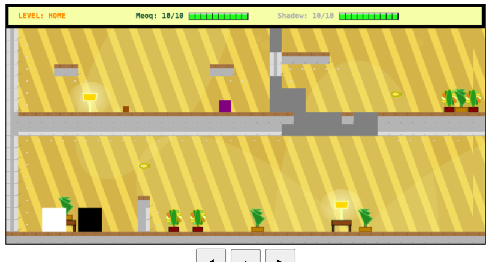

pixel kit and packs are taken from itch.io
cats https://bowpixel.itch.io/meow-cat-85-animation?download

Music:
You must give appropriate credit: Song title, artist name, source (Free Music Archive) and license type (CC BY)

Home level: [Lenny Pixels](https://freemusicarchive.org/music/lenny-pixels/)

TODO:
- [X] Cats death and game over screens
- [X] fix start over mechanics
- [X] fix collision
- [X] Boss firing
- [X] parallax background
- [] cleanup artefacts
- [] Fix collision for enemies
- [] +2 types of enemy: shooting and flying?
- [] cut scenes
- [X] designs
- [X] add music and sounds
- [] add effects
- [] cleanup all logs
- [] fix poops for white cat
- [] boss for 2nd and 3rd level
- [] pink cat at 3rd level
- [] compress to fit to 13k
- [] add visual effect of taking damage for cat and enemies

## Maps
There are two commands to compress and decompress maps, see package.json

Progress
29-08-2025

02-09-2025

03-09-2025
